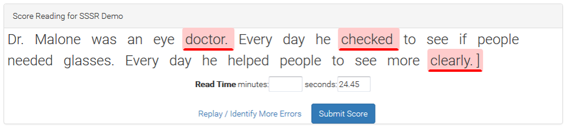
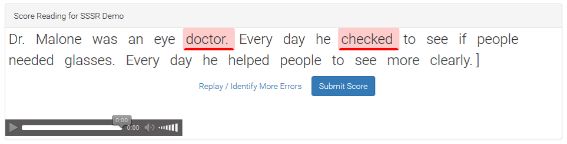

```{r setup, include=FALSE}
library(rio)
library(tidyverse)
library(gt)
library(janitor)
library(ggthemes)
```
<h2 id="top" /h2>

#Study Purpose

The purpose of this study is to compare oral reading fluency (CBM-R) scores as generated by an ASR engine compared to human assessor scores, and to compare the shorter CORE passages to traditional CBM-R passages.


## Research Questions

(1a) Are there differences in words correct per minute (WCPM) between the human scoring criterion versus traditional or ASR scoring of traditional CBM-R and CORE passages?
(1b) Are there differences in words correct per minute (WCPM) between the traditional CBM-R and CORE passages?
(2) Are there differences in time duration between the human scoring criterion versus traditional or ASR scoring of traditional CBM-R and CORE passages?
(3) Are there differences at the passage-level in word score agreement rates between the human scoring criterion versus traditional or ASR scoring of traditional CBM-R and CORE passages?

# Method

This study was conducted across 2014-15 (Year 1) and 2015-16 (Year 2). Year 2 was a replication of Year 1, with the intended differences between the two being the sample of participants and passages. That is, Year 2 used entirely different CORE passages but the same traditional ORF passages (i.e., easyCBM). Below we describe the study procedure, and note any design differences between the two years.

## Sample

### Teachers
We identified two local districts that used easyCBM as part of district policy, who agreed to participate in the study for a reduction in the annual cost of the district version of easyCBM. In addition, all participating teachers were paid a research incentive ($50 gift card) for participation, which required the online scoring of selected passages and the completion of a survey. In Year 1, District A identified nine teachers (three in each of Grades 2-4) in two schools who agreed to participate in the study. In District B, we identified 10 teachers (three in Grades 2 and 4, and four in Grade 3) in two schools who agreed to participate in the study. The 19 teachers included 17 females across the three grades, with 1 male in each of Grades 2 and 3; no other demographic information was available. In Year 2, District A identified nine teachers (four in each of Grades 2 and 3, and one in Grade 4) in one school who agreed to participate in the study. Three of these teachers also participated in Year 1. In District B, we identified 12 teachers (three in each of Grades 2 and 3, and six in Grade 4) in two schools who agreed to participate in the study. Nine of these teachers also participated in Year 1. The 21 teachers included 17 females across the three grades, with 1 male in each of Grades 2 and 4, and two in Grade 3; no other teacher demographic information was available.

### Students
The student sample consisted of entire classrooms such that it would be representative, to the extent possible, of typically developing students across reading proficiency levels. We used a passive parental consent procedure for student participants, and in Year 2 we also asked for student assent. Our full sample size was n = 937 (and 14,711 audio recordings). The following records with short or long passage time durations (seconds) were removed: < 15 or > 60 for easyCBM passages; < 5 or > 80 for short passages; < 7 or > 100 for medium passages; and < 10 or > 200 for long passages. The following records with anomalous correct word counts were removed: zero words read correctly, or < 5 words read correctly for one score (ASR, Recording, Traditional) and > 5 words read correctly for another score (ASR, Recording, Traditional). As a result, 38 (4%) students and 1,590 (11%) of audio recordings were removed. Our final analytic sample consisted of 899 students (261 Grade 2, 323 Grade 3, and 315 Grade 4), and 13,121 audio recordings.

```{r, echo = FALSE, layout = "l-body-outset"}
dat01 <- import("C:/Users/Joe/Desktop/BRT/GRANT-CORE/Project/Publications/year_1_2_project/data/dat01.RData")

students_samp <- import("C:/Users/Joe/Desktop/BRT/GRANT-CORE/Project/Publications/year_1_2_project/data/students_samp.RData")

dat01 %>% 
  group_by(grade) %>%
  summarise(Students = unique(student_id) %>% length(),
            'Audio Recordings' = unique(session_id) %>% length()) %>% 
  ungroup() %>% 
  rename(Grade = grade) %>% 
  janitor::adorn_totals("row") %>% 
  bind_cols(students_samp[, -1]) %>% 
  gt() %>% 
tab_header(
    title = "Sample Description") %>%
  tab_spanner(label = "Full Sample",
              columns = vars("Students", 'Audio Recordings')) %>% 
  tab_spanner(label = "Analytic Sample",
              columns = vars(Students1, 'Audio Recordings1')) %>% 
  fmt_number(columns = vars('Audio Recordings', 'Audio Recordings1'),
             sep_mark = ",",
             decimals = 0) %>% 
  cols_label(Students1 = "Students",
             'Audio Recordings1' = 'Audio Recordings')

```

We did not require systematic student demographic information from each school, rendering a complete description of the student sample's demographics unfeasible. Thus, we present the data available from each of the four schools, as well as the accompanying NCES 2015-2016 school [Common Core of Data](http://nces.ed.gov/ccd/pubagency.asp) to provide a broad reference for the study data and schools, and to inform or limit interpretations and generalizability of results. Each school represented approximately 7% to 37% of the student sample. The missing data across student demographic variables make generalizations difficult (i.e., approximately 8% to 23% missing). According to 2015-2016 NCES school data, the student populations of the four schools ranged from 423 to 523 students, approximately half of which were students in Grades 2 through 4. Two school [locales](https://nces.ed.gov/ccd/commonfiles/glossary.asp) were classified as Towns: Distant, and two as Suburb: Midsize (for more information. All four schools received Title I funding, and the percentage of students receiving free or reduced lunch ranged from 67% to 85%. The ethnic/race majority for all schools was White (63% to 89%). 

```{r, layout = "l-body-outset"}

tab_demos <- 
 tibble::tribble(
                       ~Characteristics,                       ~grp,        ~'School A',       ~'School B',         ~'School C',          ~'School D',
   "Approximate % of sample",  "",           "37%",            "7%",             "35%",              "25%",
                    "Female",                      "Sex",           "35%",           "53%",             "44%",              "41%",
                      "Male",                      "Sex",           "42%",           "35%",             "33%",              "51%",
                   "Missing",                      "Sex",           "23%",           "12%",             "23%",               "8%",
                        "No", "Students with Disability",           "64%",           "75%",             "71%",              "78%",
                       "Yes", "Students with Disability",           "13%",           "13%",              "6%",              "14%",
                   "Missing", "Students with Disability",           "23%",           "12%",             "23%",               "8%",
           "Hispanic/Latino",                "Ethnicity",           "12%",            "3%",             "16%",              "23%",
       "Not Hispanic/Latino",                "Ethnicity",           "65%",           "85%",             "61%",              "69%",
                   "Missing",                "Ethnicity",           "23%",           "12%",             "23%",               "8%",
   "American/Alaskan Native",                     "Race",            "1%",            "3%",              "2%",               "3%",
                     "Asian",                     "Race",            "1%",            "0%",              "3%",               "1%",
                     "Black",                     "Race",            "0%",            "4%",              "1%",               "2%",
                "Multi-Race",                     "Race",            "0%",            "0%",              "4%",              "10%",
          "Pacific Islander",                     "Race",            "1%",            "0%",              "0%",               "1%",
                     "White",                     "Race",           "73%",           "81%",             "67%",              "74%",
                   "Missing",                     "Race",           "23%",           "12%",             "23%",               "8%",
                        "No",                       "EL",           "70%",           "88%",             "70%",              "78%",
                       "Yes",                       "EL",            "6%",            "0%",              "7%",              "14%",
                   "Missing",                       "EL",           "23%",           "12%",             "23%",               "8%",
            "Total Students",        "NCES 2015-16 data",           "473",           "423",             "523",              "442",
              "% Grades 2-4",        "NCES 2015-16 data",           "55%",           "55%",             "52%",              "50%",
                  "% Female",        "NCES 2015-16 data",           "46%",           "47%",             "51%",              "45%",
                   "% White",        "NCES 2015-16 data",           "77%",           "89%",             "63%",              "63%",
                     "% FRL",        "NCES 2015-16 data",           "80%",           "73%",             "67%",              "85%",
                   "Title I",        "NCES 2015-16 data",           "Yes",           "Yes",             "Yes",              "Yes",
        "Locale description",        "NCES 2015-16 data", "Town: Distant", "Town: Distant", "Suburb: Midsize", "Suburb:  Midsize"
   )


tab_demos %>% 
  group_by(grp) %>% 
  gt() %>% 
  tab_header(
    title = "Sample Description") %>%
  cols_align(align = "right",
             columns = 2:5) 
  
```

## Measures

<aside>
<a href="#top">Top</a>
</aside>

### CORE assessment
We recruited a former teacher to write the CORE passages who was also part of the team that developed the easyCBM reading comprehension and ORF passages, writing 1500-1800 word narrative texts for use as reading comprehension passages and 150-350 word narrative texts for use as ORF passages across Grades 1 through 8. She was hired to write the CORE passages primarily because of her familiarity with and expertise in passage-writing for this context, and also in recognition of her familiarity with the population of students for whom the measures were written.

Passages were written with the following specifications. Each passage was to be an original work of fiction, and be ±5 words of the target length (i.e., short = 25 words, medium = 50 words, long = 85 words). Each passage was to have a beginning, middle, and end; this broad specification was intended to give the passage writer freedom in meeting the word constraint specification, which was crucial in this project. The passage was to follow either a *problem/resolution* format, or *sequence of events* format. The problem/resolution format included: a character, a setting, an action, a problem, and a solution or an ending. The inclusion of character feelings was optional, and left to the discretion of the passage writer, given that all other specifications were met. The sequence of events format included an expanded description of a particular setting with a starting event that leads to direct and indirect consequences (but not a problem/resolution). The particular setting could be geographical, historical, or other special place. In both types of formats, there was a minimum use of dialogue and symbols. Exclusion rules for what cannot appear in passages will include: religious themes; trademark names, places, products; cultural/ethnic depictions; age inappropriate themes (e.g., violence, guns, tobacco, alcohol, drugs). 

A readability score was computed for each Year 1 passage rounding down the average of the Flesch-Kincaid Grade Level, Spache Readability Index-Revised, and Automated Readability Index. Year 1 passages with an average readability outside the targeted grade were adjusted to either increase or decrease readability, as appropriate. Due to the software variability in readability estimates and theoretical flaws of the estimates (particularly with passages shorter than 100 words), we did not use readability estimates for Year 2 passages. All passages were reviewed by an expert in assessment for screening and progress monitoring for errors (e.g., format and grammatical), and bias (e.g., gender, cultural, religious, and geographical)

Year 1 passages included 162 passages total; 54 at each of Grades 2-4, with 9 long passages, 15 medium passages, and 30 short passages for each grade. Year 1 CORE passages were arranged into three different forms per grade, such that one form comprised of 18 passages: three long CORE passages, five medium CORE passages, and 10 short CORE passages. Note that each form was approximately 250 words in total length, equivalent in length to ORF passages currently used in traditional ORF measures.

Year 2 passages included 168 passages total; 52 at each of Grades 2-4, with 11 long passages, 15 medium passages, and 30 short passages for each grade. Year 2 CORE passages were arranged into three different forms per grade, such that one form comprised of 14 passages: 2 or 3 long CORE passages, 3 or 4 medium CORE passages, and 7 or 8 short CORE passages.

Final passages included 330 passages total, 110 at each of Grades 2-4, with 20 long passages, 30 medium passages, and 60 short passages for each grade.

### Traditional ORF assessment
The [easyCBM](https://easycbm.com/) ORF measures were the traditional ORF assessments administered for the purpose of comparison to the CORE system to for the relative construct, predictive, and consequential validities of CORE. Developed in 2006, easyCBM is an online screening and progress monitoring assessment system for use in schools working under an RTI framework, available for an annual fee for district-wide adoption. easyCBM is currently used by over 143,000 teachers, representing over 1 million students in schools across every state in the country.

The ORF passages used in easyCBM were developed to assess students’ ability to fluently read narrative text. During instrument development, each form was created to be consistent in length and the readability of each form was verified to fit appropriate grade-level, initially using the Flesch-Kincaid index feature available on Microsoft Word ([Alonzo & Tindal, 2007)](http://www.brtprojects.org/wp-content/uploads/2016/05/TechRpt40_DevWrdPassFluency.pdf). The easyCBM assessment system includes 20 alternate ORF passages at each grade level, with three passages specifically identified for use as universal screeners (fall, winter, spring) and 17 passages for progress monitoring. The passages were developed to be of equivalent difficulty for each grade level following word-count, grade-level guidelines (e.g., Flesch-Kincaid readability estimates), and form equivalence empirical testing using repeated measures ANOVA to evaluate comparability of forms ([Alonzo & Tindal, 2007)](http://www.brtprojects.org/wp-content/uploads/2016/05/TechRpt40_DevWrdPassFluency.pdf). 

These traditional ORF measures have demonstrated features of technical adequacy that suggest they are sufficient to meet the needs as the comparative example of an existing traditional ORF system. During administration, students are given one minute to read as many words as possible in the connected narrative passage (approximately 250 words). The reported alternate form reliability across Grade 2 forms ranged from .91-.95 ([Anderson, Lai, et al., 2012)](http://www.brtprojects.org/wp-content/uploads/2016/05/TechRpt1217.pdf). Predictive (fall, winter) and concurrent (spring) relations between Grade 2 PRF and spring SAT-10 reading scale scores were .59-.62 and .66, respectively ([Jamgochian, et al., 2010)](http://www.brtprojects.org/wp-content/uploads/2016/05/TechRpt1004_Gr2_Rdg.pdf). Grade 2 PRF performance was strongly correlated (r = .95) with Grade 2 performance on the DIBELS ORF measure (Good & Kaminski, 2002; [Lai, Alonzo, & Tindal, 2013)](http://www.brtprojects.org/wp-content/uploads/2016/05/TechRpt1310.pdf). The reported alternate form reliability across Grade 3 PRF forms ranged from .92-.96 ([Park, Anderson, Alonzo, Lai, & Tindal, 2012)](http://www.brtprojects.org/wp-content/uploads/2016/05/TechRpt1218.pdf). Test-retest reliability for Grade 3 PRF ranged from .84-.94 ([Park et al., 2012)](http://www.brtprojects.org/wp-content/uploads/2016/05/TechRpt1218.pdf). Grade 3 PRF performance was strongly correlated (r = .94) with Grade 3 performance on the DIBELS ORF measure (Good & Kaminski, 2002; [Lai et al., 2013)](http://www.brtprojects.org/wp-content/uploads/2016/05/TechRpt1310.pdf). Predictive (fall, winter) and concurrent (spring) relations between Grade 3 PRF and year-end state achievement reading scores were .67, .66, and .67, respectively ([Saez et al., 2010)](http://www.brtprojects.org/wp-content/uploads/2016/05/TechRpt1005_easyCBMRdgG3-7_09-10.pdf). For Grade 4 PRF forms, alternate form reliability ranged from .83-.98 ([Alonzo, Lai, Anderson, Park, & Tindal, 2012)](http://www.brtprojects.org/wp-content/uploads/2016/05/TechRpt1219.pdf). Test-retest reliability ranged from .86-.96 ([Alonzo et al., 2012]( http://www.brtprojects.org/wp-content/uploads/2016/05/TechRpt1219.pdf)). Grade 4 PRF performance was also strongly correlated (r = .93) with Grade 4 performance on the DIBELS ORF measure (Good & Kaminski, 2002; [Lai et al., 2013)](http://www.brtprojects.org/wp-content/uploads/2016/05/TechRpt1310.pdf). Predictive (fall, winter) and concurrent (spring) relations between Grade 4 PRF and year-end state achievement reading scores were .67, .64, and .66 respectively [(Saez et al., 2010)](http://www.brtprojects.org/wp-content/uploads/2016/05/TechRpt1005_easyCBMRdgG3-7_09-10.pdf).

## Procedures

<aside>
<a href="#top">Top</a>
</aside>

### Assessor Training
We recruited and trained assessors to administer and score all study passages. Year 1 included 14 assessors: five with doctoral degrees in education, five graduate students in a college of education, one with a master’s degree in the field of education, and three university staff. Year 2 included 22 assessors: seven undergraduate students, seven graduate students in a college of education, four with doctoral degrees in education, two with a master’s degree in the field of education, and two university staff (nine were assessors in Year 1). Assessors were given training and instruction by experts in assessment for screening and progress monitoring on the following: the study website; using an introductory script with students; administering the passages; scoring passages; and application of the stopping rules. During the training sessions assessors practiced scoring passages that were read aloud by a training leader, with planned errors, omissions, self-corrections, and disfluent reading. Inter-rater reliability was calculated using [Cohen’s (1960)](https://journals.sagepub.com/doi/pdf/10.1177/001316446002000104) kappa (\(\kappa\)) procedure. 

The Year 1 \(\kappa\) coefficients for 12 assessors (not including the two training leaders) were above .90, and 11 assessors perfectly scored the last training passage (\(\kappa\) = 1.0).

Year 2 \(\kappa\) coefficients for 18 assessors (not including the three training leaders) were above .87 across the nine training passages, and above .91 for 15 assessors.

### Administration
We conducted the study in the springs of 2015 (April, May) and 2016 (March). Students were assessed online, via laptops (PC or Mac) in a one-to-one administration setting. All passage text completely fit the screen so no scroll was needed. The first passage was the grade-level traditional ORF passage (easyCBM), which was read for 60 seconds. Following traditional ORF administration, the student read one CORE form (18 passages in Year 1 and 14 passages in Year 2). To control for potential fatigue and order effects, three versions of each CORE form (per grade) were created such that: (a) passages were always grouped consecutively by length, (b) these groups of passages were alternately ordered such that each (short, medium, and long) were administered first, second, and last, and (c) passages were alternately ordered within length. Forms were randomly assigned at the student level prior to assessment administration. 

The student was seated in front of the computer and given the following instructions. 

<aside>
In Year 2, we obtained student consent to participate before the following.
</aside>

> Today, you are going to be reading a bunch of different little stories out loud to me. The stories will be on my computer, and you will read them one at a time. If you come to a word you do not know, you can try to sound it out, or you can skip over it. If you pause for a little while, I’ll tell you to skip the word, and you can go on. You need to read loudly enough that I can hear you. If I need you to speak up, I’ll let you know by moving my hand like this: *(demonstrated by raising your hand, palm up, to encourage more volume)*. Do you have any questions?

The student was seated in front of the computer and given a standardized introduction and task instructions. Students wore headphones with an attached noise-cancelling microphone. Students were given the choice to use the mouse to navigate through the passages, or have the assessor do it. Assessors asked the student read the first passage for 60 seconds. Once the student clicked *Start*, the first story appeared on the screen. While a student read, the assessors followed on a paper copy, marking a slash (/) through any word the student skipped or read incorrectly, and marking a right bracket (]) after the last word the student read in 60 secs. After 60 secs, the assessor asked the student to stop reading and clicked the *Done* button at the bottom of the passage. Prior to displaying the next passage, this system presented an intermediary page before the next passage was presented. After the traditional ORF passage, each subsequent CORE passage was read in its entirety and the assessors followed along on the paper copy with the same scoring rules as described. Assessors also recorded the time duration of the reading. This process continued until the final passage was read.

#### Stopping rule
If a student failed to produce any words in the first 10 seconds and it was clear s/he as a non-reader, the assessment was terminated and the student was excluded from the study.

#### Abbreviated administration rule
If a student read lower than the 10th percentile for the first passage (i.e., traditional ORF), then for all remaining CORE passages, they were instructed to read only for 30 secs, and the last word read after 30 seconds was marked by the assessor. Percentiles were drawn from published easyCBM materials for each grade level (Grade 2: < 41 WCPM, Grade 3: < 61 WCPM, Grade 4: < 81 WCPM; [Saven, Tindal, Irvin, & Alonzo, 2014](https://www.brtprojects.org/wp-content/uploads/2016/05/TechRpt1409_easyCBM_Norms.pdf)). We instituted this rule so as not to stress exceptionally poor readers by having them read for an excessive amount of time.

## Scoring 

<aside>
<a href="#top">Top</a>
</aside>

An online system was used to administer, score, record, and save all passage readings. All passages were scored in the three ways as described below. Words correct per minute (WCPM) were the number of correctly read words divided by the duration in seconds divided by 60.

Here is a sample passage (and audio) from the study of Grade 3, short CORE passage. As you listen, imagine that you are the assessor and you are tasked with scoring words read incorrectly (self-corrections do not count) and also to record the time for the student to read. This is the task that human CBM-R assessors perform in real-time, and also what the ASR is tasked to accomplish

> Phillip ran cross-country and was always second at the end of the race. He did his best and one day finally finished first.

<aside>
Sample audio from the study of a Grade 3 student reading a short CORE passage.
<audio controls>
  <source src="media1.wav" type="audio/wav">
</audio>
</aside>


The table below shows the mean and *SD* WCPM by grade and passage length for each of the three scoring methods, as well as the counts of passages, students, and audio recordings. 

```{r, layout = "l-body-outset"}
dat03 <- import("C:/Users/Joe/Desktop/BRT/GRANT-CORE/Project/Publications/year_1_2_project/data/dat03.RData")

t1 <- dat03 %>% 
    as_tibble() %>% 
    select(student_id2, grade, passage_id, passage_length,
           wcpm_asr3, wcpm_during2, wcpm_after3) %>%
    gather(key=mode, value=wcpm, 5:7) %>% 
    arrange(student_id2, passage_id) %>% 
    group_by(grade, passage_length, mode) %>% 
    summarise(wcpm_mean = mean(wcpm),
              wcpm_sd = sd(wcpm)) %>% 
  ungroup() %>% 
  nest(-mode) %>% 
  spread(mode, data) %>% 
  unnest() %>% 
  select(-c(grade1, grade2, passage_length1, passage_length2)) 

table_word_agree <- import("C:/Users/Joe/Desktop/BRT/GRANT-CORE/Project/Publications/year_1_2_project/data/table_word_agree.RData")

table_word_agree %>%   
  select(grade, passage_length = length, n.passages, n.students, n.sessions) %>% 
  right_join(t1) %>% 
  mutate(grade = recode(grade,
                      '2' = "Grade 2",
                      '3' = "Grade 3",
                      '4' = "Grade 4")) %>% 
  select(grade, passage_length, wcpm_mean:wcpm_sd2, tidyselect::everything()) %>% 
  group_by(grade) %>% 
  gt() %>% 
  tab_header(
    title = "WCPM Mean & SD and Frequencies") %>%
  tab_spanner(label = "Recording",
              columns = vars(wcpm_mean, wcpm_sd)) %>% 
  tab_spanner(label = "ASR",
              columns = vars(wcpm_mean1, wcpm_sd1)) %>% 
  tab_spanner(label = "Traditional",
              columns = vars(wcpm_mean2, wcpm_sd2)) %>% 
  tab_spanner(label = "Count",
              columns = vars(n.passages, n.students, n.sessions)) %>% 
  fmt_number(
    columns = 2:7,
    decimals = 1
  ) %>% 
  fmt_number(columns = vars(n.sessions),
             sep_mark = ",",
             decimals = 0) %>% 
  cols_label(passage_length = "",
              wcpm_mean	= "Mean",
              wcpm_sd = "SD",
              wcpm_mean1	= "Mean",
              wcpm_sd1 = "SD",
              wcpm_mean2	= "Mean",
              wcpm_sd2 = "SD",
             n.passages = "Passages",
             n.students = "Students",
             n.sessions = "Audio Recordings")
```

```{r, layout="l-screen-inset"}

dat03 %>% 
  as_tibble() %>% 
  select(student_id2, grade, passage_id, passage_length,
         wcpm_asr3, wcpm_during2, wcpm_after3) %>%
  gather(key=mode, value=wcpm, 5:7) %>% 
  arrange(student_id2, passage_id) %>% 
  group_by(grade, passage_length, mode) %>% 
  summarise(wcpm_mean = mean(wcpm),
            wcpm_sd = sd(wcpm),
            asymp.LCL = wcpm_mean - (1.96*wcpm_sd),
            asymp.UCL = wcpm_mean + (1.96*wcpm_sd)) %>% 
  ungroup() %>% 
  mutate(mode = recode(mode,
                       wcpm_after3 = "Recording",
                       wcpm_asr3 = "ASR",
                       wcpm_during2 = "Traditional"),
         grade = recode(grade,
                        '2' = "Grade 2",
                        '3' = "Grade 3",
                        '4' = "Grade 4")) %>%
  ggplot(aes(x=passage_length, y=wcpm_mean, group=mode, colour=mode)) + 
  facet_wrap(~grade) +
  geom_point(position=position_dodge(width=0.5)) +
  geom_errorbar(aes(ymin = asymp.LCL, ymax = asymp.UCL),
                position=position_dodge(width=0.5)) +
  theme_bw() +
  theme(strip.background = element_rect(colour = "black", , fill = "white")) +
  labs(
    x = "Passage Length",
    y = "WCPM",
    color = "") +
  scale_colour_solarized('blue', name = "") +
  theme(axis.text.x = element_text(angle = 45, hjust = 1))
```

### Traditional
Scoring followed the rules established by traditional CBM-R administration. Students did their best reading while the trained assessor followed along and indicated on a (paper) scoring protocol each word the student reads incorrectly ([Wayman et al., 2007](https://journals.sagepub.com/doi/abs/10.1177/00224669070410020401)). Student self-corrections were not marked as errors, but word omissions were. If a student paused for more than three seconds, the assessor prompted the student to continue reading (without providing the correct work, which is the only deviation from traditional scoring) and marked the word as read incorrectly. The elapsed time to read the passage was also recorded by the assessor. 

<aside>

</aside>

### Criterion (Recording)
The recorded audio files were scored by the trained assessors at a later date and in a different setting from which the data were collected. Assessors wore headsets and listened to each recorded audio file (with the ability to rewind, replay, and adjust audio), using the same scoring rules as the traditional procedures. The elapsed time to read the passage was not recorded. All data were entered into the study site online. These scores are considered the criterion to which the traditional CBM-R and ASR scores are compared.

<aside>

</aside>

### Automatic speech recognition (ASR)
The automatic speech recognition software scored each recorded audio file. The ASR system scored each word as read correctly or incorrectly (i.e., response accuracy), and recorded the precise time for a student to read each word (including words read incorrectly or inserted words).

The ASR system used continuous density Hidden Markov Models. It supports Maximum Likelihood Linear Regression, Vocal Tract Length Normalization and discriminative training (Maximum Mutual Information). It also produces a word graph that is used to estimate posterior probabilities. It used the general approach of many state-of-the art speech recognition systems: a Viterbi Beam Search is used to find the optimal mapping of the speech input onto a sequence of words. The score for a word sequence was calculated by interpolating Language Model scores and Acoustic Model scores. The Language Model assigns probabilities to sequences of words using trigrams, where the probability of the next word is conditioned on the two previous words. The Language Models were trained using the CMU-Cambridge LM Toolkit (Clarkson & Rosenfeld, 1997). Feature extraction from the audio was carried out using Mel Frequency Cepstral Coefficients (MFCC) plus the logarithm of the signal energy. Cepstral coefficients were extracted using a 20 ms window size and a 10 ms shift, which produced a feature vector each 10 ms that is composed of 12 MFCCs plus the log energy and the first and second order derivatives. Acoustic Models were clustered triphones based on Hidden Markov Models using Gaussian Mixtures to estimate the probabilities of the acoustic observation vectors. The system used filler models to match the types of disfluencies found in applications.

<aside>
<a href="#top">Top</a>
</aside>

## Acknowledgments {.appendix}

The research reported here was supported by the Institute of Education Sciences, U.S. Department of Education, through Grant [R305A140203](https://ies.ed.gov/funding/grantsearch/details.asp?ID=1492) to the University of Oregon. The opinions expressed are those of the authors and do not represent views of the Institute or the U.S. Department of Education.