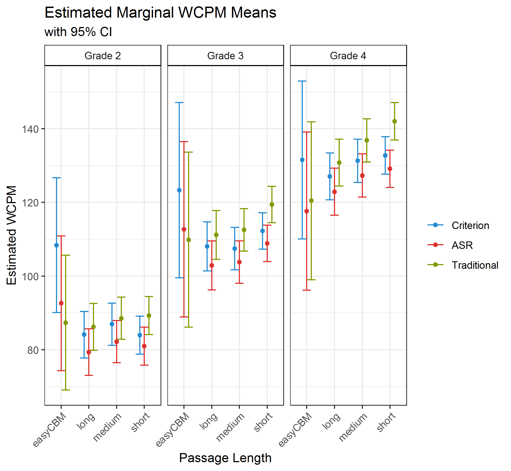

<h2 id="top" /h2>

```{r}
library(rio)
library(tidyverse)
library(purrr)
library(stringr)
library(gt)
library(knitr)
library(ggthemes)

```


## Introduction

We examined the differences in three scoring methods for words correct per minute (WCPM) scores of curriculum-based measurement of oral reading fluency (CBM-R). The three `scoring methods` were: (1) `Traditional` - the real-time human scores, comparable to traditional CBM-R assessments in schools; (2) `ASR` - automatic speech recognition scores; and (3) `Recording` - the criterion measure, where recorded audio files were scored by human assessors in a private space wearing headsets (with the ability to rewind, replay, and adjust audio). We also explored the effect of `passage length` using: (1) *easyCBM* passages as traditional CBM-R passages of about 250 words read for 60 seconds; and **CORE** passages read in their entirety that were (2) *long*, about 85 words, (3) *medium*, about 50 words, and (4) *short*, about 25 words.

This is the first study to compare scores by expert assessors to both ASR and traditional CMB-R scores consistent with those conducted in schools. These comparisons allowed for the analysis of the potential net gain of ASR compared to current school practices (as opposed to scores based on audio recordings), which we speculate is a more useful metric for educators, administrators, school district officials, and stakeholders.

These results are part of our larger **Content & Convergent Evidence Study**. For details about the Content & Convergent Evidence Study procedures, including information on the sample, CBM-R passages, administration, and scoring methods, go [here](https://jnese.github.io/core-blog/posts/2019-04-04-content-convergent-evidence-study-procedures/).


## Summary

We found statistically significant and substantive differences in WCPM scores between the `Recording criterion` and both `ASR` and `Traditional` CBM-R scoring. The magnitude of the effect sizes did not favor either the `ASR` or the `Traditional` scores, providing evidence that the `ASR` WCPM scores were just as suitable as the `Traditional` WCPM scores, when compared to the `Recording` criterion. 

Thus, there is evidence that `ASR` can be applied in schools to score WCPM on CBM-R assessments.

This has implications for the opportunity cost of CBM-R administration. Traditional CBM-R is administered in a one-to-one setting, requiring resources like adequately private, quiet space; time and human personnel to assess the entire classroom or school for universal screening; and high-quality, reliable, and trained human assessors. A computerized CBM-R system that incorporates a validated ASR can (a) reduce human administration errors by standardizing administration setting, delivery, and scoring, and (b) reduce the cost of administration by simultaneously testing small groups or an entire classroom in only a few minutes with only one educator to monitor the environment. This can reduce the cost of CBM-R administration by eliminating the need to train staff to administer and score the assessment, which stands to make a considerable benefit to CBM-R applications in schools.

## Analysis

We applied a mixed-effects model for **WCPM** scores separately for each of Grades 2 through 4, with random effects for `students` and `passages`, and fixed effects for `scoring method` (three levels: *ASR*, *Recording*, and *Traditional*), `passage length` (four levels: *easyCBM*, *short*, *medium*, and *long*), and their interaction `passage length:scoring method`. For documentaiton of the model building process go [here](https://jnese.github.io/core-blog/posts/2019-04-06-cce-auxiliary-modelbuilding/).

```
wcpm ~ 1 + (1|student_id) + (1|passage_id) + 
           passage_length + scoring_method + passage_length:scoring_method, REML = FALSE))
```

## Results

The following table shows the results of this model.

```{r layout="l-body-outset"}
step_fixd_effcts <- import("C:/Users/Joe/Desktop/BRT/GRANT-CORE/Project/Publications/year_1_2_project/data/step_fixd_effcts.Rdata")

# table_final_model <- import("C:/Users/Joe/Desktop/BRT/GRANT-CORE/Project/Publications/year_1_2_project/tables/table_final_model.html")

step_fixd_effcts %>% 
  select(grade, tidy_results) %>%
  spread(grade, tidy_results) %>% 
  unnest() %>% 
  select(-term1, -term2) %>% 
  gt() %>%  
  tab_spanner(label = "Grade 2",
              columns = vars(estimate, std.error, statistic)) %>% 
  tab_spanner(label = "Grade 3",
              columns = vars(estimate1, std.error1, statistic1)) %>% 
  tab_spanner(label = "Grade 4",
              columns = vars(estimate2, std.error2, statistic2)) %>% 
  text_transform(
    locations = cells_data(
      columns = vars(term)),
    fn = function(x) {
      stringr::str_replace_all(x, "passage_length", "")
    }
  ) %>% 
  text_transform(
    locations = cells_data(
      columns = vars(term)),
    fn = function(x) {
      stringr::str_replace(x, "\\s*\\([^\\)]+\\)", "Intercept")
    }
  ) %>% 
  text_transform(
    locations = cells_data(
      columns = vars(term)),
    fn = function(x) {
      stringr::str_replace_all(x, "modewcpm_", "")
    }
  ) %>%
  text_transform(
    locations = cells_data(
      columns = vars(term)),
    fn = function(x) {
      stringr::str_replace_all(x, "sd_Intercept.", "")
    }
  ) %>%
  text_transform(
    locations = cells_data(
      columns = vars(term)),
    fn = function(x) {
      stringr::str_replace_all(x, "sd_Observation.", "")
    }
  ) %>%
  text_transform(
    locations = cells_data(
      columns = vars(term)),
    fn = function(x) {
      stringr::str_replace_all(x, "long", "Long")
    }
  ) %>% 
  text_transform(
    locations = cells_data(
      columns = vars(term)),
    fn = function(x) {
      stringr::str_replace_all(x, "medium", "Medium")
    }
  ) %>% 
  text_transform(
    locations = cells_data(
      columns = vars(term)),
    fn = function(x) {
      stringr::str_replace_all(x, "short", "Short")
    }
  ) %>% 
  text_transform(
    locations = cells_data(
      columns = vars(term)),
    fn = function(x) {
      stringr::str_replace_all(x, "asr3", "ASR")
    }
  ) %>% 
  text_transform(
    locations = cells_data(
      columns = vars(term)),
    fn = function(x) {
      stringr::str_replace_all(x, "during2", "Traditional")
    }
  ) %>% 
  text_transform(
    locations = cells_data(
      columns = vars(term)),
    fn = function(x) {
      stringr::str_replace_all(x, "student_id2", "Students")
    }
  ) %>% 
  text_transform(
    locations = cells_data(
      columns = vars(term)),
    fn = function(x) {
      stringr::str_replace_all(x, "passage_id", "Passages")
    }
  ) %>% 
  tab_row_group(
    group = "Fixed Effects",
    row = c(1:12)
  ) %>% 
  tab_row_group(
    group = "Random Effects (SD)",
    row = c(13:15)
    #    row = matches("Students|Passages|Residual")
  ) %>% 
  cols_label(
    estimate = "Estimate",
    std.error = "SE",
    statistic = "t-value",
    estimate1 = "Estimate",
    std.error1 = "SE",
    statistic1 = "t-value",
    estimate2 = "Estimate",
    std.error2 = "SE",
    statistic2 = "t-value",
    term = ""
  ) %>% 
  fmt_missing(
      columns = TRUE,
      missing_text = "--") %>% 
  fmt_number(
      columns = 2:10,
      decimals = 2
    ) %>% 
  tab_footnote(footnote = "Intercept represents easyCBM passages with Traditional scores.",
                locations = cells_data(
                  columns = c(1),
                  rows = c(1)))

```
  
  
Based on the model's results, we calculated pairwise comparisons from the estimated marginal means to examine the effects of `scoring method`.

The figure below shows the estimated marginal **WCPM** means for each `scoring method` by grade and `passage length`. The 95% confidence intervals for al comparisons overlap, suggesting that the estimated WCPM scores across `scoring methods` are relatively comparable. 

```{r layout="l-body-outset"}

```

To assist the interpretation of the results of the final model, we also report the statistical significance of the differences in marginal means, as well as Cohen’s (1988) *d* effect size estimates in the table below.

All but two pairwise comparisons (across grades and passage lengths) between the `Recording` criterion and the `ASR` or `Traditional` WCPM scores were statistically significant at the *p* = .01 level. Thus, both the `ASR` and `Traditional` scores were statistically significantly different from `Recording` criterion scores. 

An examination of the magnitude of the effect sizes between the `Recording` criterion and the `ASR` or `Traditional` WCPM scores showed mixed results. Of the 12 comparisons (four passage lengths x three grades), the `Recording` - `ASR` effect size was smaller in absolute magnitude than the `Recording` - `Traditional` in seven comparisons, always for the *short* passages, never for the *long* passages, and mixed results for the other passages lengths and by grade. This provides weak support to favor the `ASR` scores over the `Traditional` scores in our study.

For the *easyCBM* passages, both the `ASR` and the `Traditional` scores always underestimated WCPM compared to the `Recording`, and the `ASR` was always higher than the `Traditional` (except for Grade 4). For all of the **CORE** passage lengths (*long*, *medium*, and *short*) across grades, the `ASR` underestimated and the `Traditional` overestimated the WCPM compared to the `Recording` scores. The `Traditional` also overestimated the WCPM scores compared to the `ASR.`

Ideally, there would have been no difference between the `ASR` and `Recording` criterion scores, but our results provide evidence that `ASR` scores are comparable to the existing, `Traditional` CBM-R scores. 


```{r, layout="l-screen-inset"}
pairwise_wcpm_scoring <- import("C:/Users/Joe/Desktop/BRT/GRANT-CORE/Project/Publications/year_1_2_project/data/pairwise_wcpm_scoring.Rdata")

pairwise_wcpm_scoring %>% 
  select(grade, pairs_scoring, es_scoring) %>%
  unnest() %>% 
  select(grade, mode_pairwise, passage_length, estimate, std.error, z.ratio, p.value, coh_d) %>% 
  mutate(mode_pairwise = str_replace_all(mode_pairwise, "wcpm_after3", "Recording"),
         mode_pairwise = str_replace_all(mode_pairwise, "wcpm_asr3", "ASR"),
         mode_pairwise = str_replace_all(mode_pairwise, "wcpm_during2", "Traditional"),
         p.value = ifelse(p.value< .00049, "< 0.001", round(p.value, 3)),
         coh_d = coh_d * -1) %>% 
  nest(-grade) %>% 
  spread(grade, data) %>% 
  unnest() %>% 
  select(-c(mode_pairwise1, mode_pairwise2, passage_length1, passage_length2)) %>% 
  group_by(passage_length) %>% 
  gt() %>% 
  fmt_number(
    columns = vars(estimate, std.error, z.ratio, coh_d, 
                   estimate1, std.error1, z.ratio1, coh_d1,
                   estimate2, std.error2, z.ratio2, coh_d2),
    decimals = 2
  ) %>% 
  tab_spanner(label = "Grade 2",
              columns = vars(estimate, std.error, z.ratio, p.value, coh_d)) %>% 
  tab_spanner(label = "Grade 3",
              columns = vars(estimate1, std.error1, z.ratio1, p.value1, coh_d1)) %>% 
  tab_spanner(label = "Grade 4",
              columns = vars(estimate2, std.error2, z.ratio2, p.value2, coh_d2)) %>% 
  cols_label(
    estimate = "Estimate",
    std.error = "SE",
    z.ratio = "z-value",
    p.value = "p-value",
    coh_d = "Effect Size",
    estimate1 = "Estimate",
    std.error1 = "SE",
    z.ratio1 = "z-value",
    p.value1 = "p-value",
    coh_d1 = "Effect Size",
    estimate2 = "Estimate",
    std.error2 = "SE",
    z.ratio2 = "z-value",
    p.value2 = "p-value",
    coh_d2 = "Effect Size",
    mode_pairwise = ""
  )


```

## Acknowledgments {.appendix}

The research reported here was supported by the Institute of Education Sciences, U.S. Department of Education, through Grant [R305A140203](https://ies.ed.gov/funding/grantsearch/details.asp?ID=1492) to the University of Oregon. The opinions expressed are those of the authors and do not represent views of the Institute or the U.S. Department of Education.
