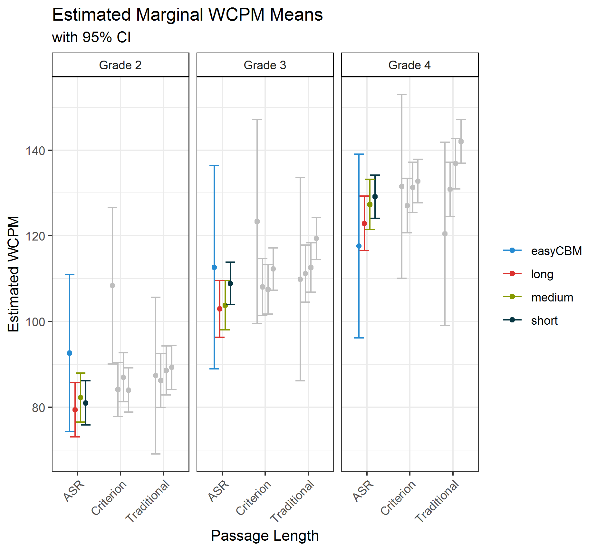

<h2 id="top" /h2>

```{r}
library(rio)
library(tidyverse)
library(stringr)
library(gt)
library(knitr)
library(ggthemes)
library(numform)
```

## Introduction

We examined the differences in passage length for words correct per minute (WCPM) scores of curriculum-based measurement of oral reading fluency (CBM-R). The four `passage lengths` were: (1) `easyCBM` passages as traditional CBM-R passages of about 250 words read for 60 seconds; and **CORE** passages read in their entirety that were (2) `long`, about 85 words, (3) `medium`, about 50 words, and (4) `short`, about 25 words. We also explored the effect of `scoring method` using: (1) *Traditional* - the real-time human scores, akin to traditional CBM-R assessments in schools; (2) *ASR* - automatic speech recogntion scores; and (3) *Recording* - the criterion measure, where recorded audio files were scored by human assessors in a private space wearing headsets (with the ability to rewind, replay, and adjust audio). Results for effects of `scoring methods` can be found [here](https://jnese.github.io/core-blog/posts/2019-04-16-asr-can-score-cbmr-assessments/).

These results are part of our larger **Content & Convergent Evidence Study**. For details about the Content & Convergent Evidence Study procedures, including information on the sample, CBM-R passages, administration, and scoring methods, go [here](https://jnese.github.io/core-blog/posts/2019-04-04-content-convergent-evidence-study-procedures/).

## Summary

When using ASR scoring – [as previously established is acceptable](https://jnese.github.io/core-blog/posts/2019-04-16-asr-can-score-cbmr-assessments/) – there are no statistically significant differences in WCPM based on `passage length`, suggesting that the WCPM scores of the shorter **CORE** passages are generally comparable to the scores on  traditional CBM-R passages. These findings provide preliminary evidence that shorter passages can be administered in schools as part of CBM-R assessment practrices. 

This finding has the potential to make a sizable contribution to the field under the idea that traditional CBM-R administration can be made even briefer (e.g., 30 seconds), saving time and resources. 

Using multiple shorter CBM-R passages also has the potential the increase the reliability and reduce the standard error of WCPM scores, much like increasing the number of items on a test increases the reliability properties of the test. Increased reliability of CBM-R scores would provide educators with more accurate scores with which to monitor student CBM-R progress over time, and thus increase the consequential validity of the decisions based on those scores.

## Analysis

We applied a mixed-effects model for **WCPM** scores separately for each of Grades 2 through 4, with random effects for `students` and `passages`, and fixed effects for `passage length` (four levels: *easyCBM*, *short*, *medium*, and *long*), `scoring method` (three levels: *ASR*, *Recording*, and *Traditional*), and their interaction `passage length:scoring method`. For documentaiton of the model building process go [here](https://jnese.github.io/core-blog/posts/2019-04-06-cce-auxiliary-modelbuilding/).

```
wcpm ~ 1 + (1|student_id) + (1|passage_id) + 
           passage_length + scoring_method + passage_length:scoring_method, REML = FALSE))
```

## Results

The following table shows the results of this model.

```{r layout="l-body-outset"}
step_fixd_effcts <- import("C:/Users/Joe/Desktop/BRT/GRANT-CORE/Project/Publications/year_1_2_project/data/step_fixd_effcts.Rdata")

step_fixd_effcts %>% 
  select(grade, tidy_results) %>%
  spread(grade, tidy_results) %>% 
  unnest() %>% 
  select(-term1, -term2) %>% 
  gt() %>%  
  tab_spanner(label = "Grade 2",
              columns = vars(estimate, std.error, statistic)) %>% 
  tab_spanner(label = "Grade 3",
              columns = vars(estimate1, std.error1, statistic1)) %>% 
  tab_spanner(label = "Grade 4",
              columns = vars(estimate2, std.error2, statistic2)) %>% 
  text_transform(
    locations = cells_data(
      columns = vars(term)),
    fn = function(x) {
      stringr::str_replace_all(x, "passage_length", "")
    }
  ) %>% 
  text_transform(
    locations = cells_data(
      columns = vars(term)),
    fn = function(x) {
      stringr::str_replace(x, "\\s*\\([^\\)]+\\)", "Intercept")
    }
  ) %>% 
  text_transform(
    locations = cells_data(
      columns = vars(term)),
    fn = function(x) {
      stringr::str_replace_all(x, "modewcpm_", "")
    }
  ) %>%
  text_transform(
    locations = cells_data(
      columns = vars(term)),
    fn = function(x) {
      stringr::str_replace_all(x, "sd_Intercept.", "")
    }
  ) %>%
  text_transform(
    locations = cells_data(
      columns = vars(term)),
    fn = function(x) {
      stringr::str_replace_all(x, "sd_Observation.", "")
    }
  ) %>%
  text_transform(
    locations = cells_data(
      columns = vars(term)),
    fn = function(x) {
      stringr::str_replace_all(x, "long", "Long")
    }
  ) %>% 
  text_transform(
    locations = cells_data(
      columns = vars(term)),
    fn = function(x) {
      stringr::str_replace_all(x, "medium", "Medium")
    }
  ) %>% 
  text_transform(
    locations = cells_data(
      columns = vars(term)),
    fn = function(x) {
      stringr::str_replace_all(x, "short", "Short")
    }
  ) %>% 
  text_transform(
    locations = cells_data(
      columns = vars(term)),
    fn = function(x) {
      stringr::str_replace_all(x, "asr3", "ASR")
    }
  ) %>% 
  text_transform(
    locations = cells_data(
      columns = vars(term)),
    fn = function(x) {
      stringr::str_replace_all(x, "during2", "Traditional")
    }
  ) %>% 
  text_transform(
    locations = cells_data(
      columns = vars(term)),
    fn = function(x) {
      stringr::str_replace_all(x, "student_id2", "Students")
    }
  ) %>% 
  text_transform(
    locations = cells_data(
      columns = vars(term)),
    fn = function(x) {
      stringr::str_replace_all(x, "passage_id", "Passages")
    }
  ) %>% 
  tab_row_group(
    group = "Fixed Effects",
    row = c(1:12)
  ) %>% 
  tab_row_group(
    group = "Random Effects (SD)",
    row = c(13:15)
    #    row = matches("Students|Passages|Residual")
  ) %>% 
  cols_label(
    estimate = "Estimate",
    std.error = "SE",
    statistic = "t-value",
    estimate1 = "Estimate",
    std.error1 = "SE",
    statistic1 = "t-value",
    estimate2 = "Estimate",
    std.error2 = "SE",
    statistic2 = "t-value",
    term = ""
  ) %>% 
  fmt_missing(
      columns = TRUE,
      missing_text = "--") %>% 
  fmt_number(
      columns = 2:10,
      decimals = 2
    ) %>% 
  tab_footnote(footnote = "Intercept represents easyCBM passages with Traditional scores.",
                locations = cells_data(
                  columns = c(1),
                  rows = c(1)))

```

Based on the model's results, we calculated pairwise comparisons from the estimated marginal means to examine the effects of `passage length`.

The figure below shows the estimated marginal WCPM means for each `passage length` by grade and `scoring method`. The 95% confidence intervals for all comparisons overlap, suggestig that the estimated WCPM scores across `passage length` are relatively comparable. 

```{r layout="l-body-outset"}

```

To assist the interpretation of the results of the final model, we also report the statistical significance of the differences in marginal means, as well as Cohen’s (1988) *d* effect size estimates in the table below.

None of the pairwise comparisons (across grades and scoring methods) between the **CORE** passages (`long`, `medium`, and `short`) and traditional `easyCBM` passages were statistically significant at the *p* = .01 level, except for two *Recording* criteria WCPM scores (Grade 2 `easyCBM-long` and `easyCBM-short`), and one *Traditional* WCPM score for Grade 4 `long-short`. 

An examination of the magnitude of the effect sizes across all scoring methods showed that the largest absolute differences were between the `easyCBM` and `short` or `medium` length passages. The smallest absolute differences were between the `long` and `medium` length passages for Grades 2 and 3, and between the `medium` and `short` in Grade 4.


In general, the estimated mean WCPM differences and effect sizes are larger when comparing `easyCBM` passages to **CORE** passages. But while the effect size differences increased across Grades 2 to 3 to 4, the opposite pattern was observed for the estimated differences, because the *SE* remained relatively stable across grades (for the pairwise comparison estimates and *d*).

Importantly, the *ASR* results (top of the table below) provide evidence that when using *ASR* scoring there were no statistically significant differences in WCPM based on `passage length`.

Thus, the scores the shorter **CORE** passages were generally comparable to the scores on the traditional `easyCBM` passages.

```{r, layout="l-screen-inset"}
pairwise_wcpm_pssglngth <- import("C:/Users/Joe/Desktop/BRT/GRANT-CORE/Project/Publications/year_1_2_project/data/pairwise_wcpm_pssglngth.Rdata")

pairwise_wcpm_pssglngth %>% 
  select(grade, pairs_pssglngth, es_pssglngth) %>%
  unnest() %>%
  select(grade, passage_length_pairwise, mode, estimate, std.error, z.ratio, p.value, coh_d) %>%
  mutate(mode = str_replace_all(mode, "wcpm_after3", "Recording"),
         mode = str_replace_all(mode, "wcpm_asr3", "ASR"),
         mode = str_replace_all(mode, "wcpm_during2", "Traditional"),
         p.value = ifelse(p.value< .00049, "< 0.001", f_num(p.value, 3)),
         coh_d = coh_d * -1) %>% 
  nest(-grade) %>% 
  spread(grade, data) %>% 
  unnest() %>% 
  select(-c(passage_length_pairwise1, passage_length_pairwise2, mode1, mode2)) %>% 
  group_by(mode) %>% 
  gt() %>% 
  fmt_number(
    columns = vars(estimate, std.error, z.ratio, coh_d, 
                   estimate1, std.error1, z.ratio1, coh_d1,
                   estimate2, std.error2, z.ratio2, coh_d2),
    decimals = 2
  ) %>% 
  tab_spanner(label = "Grade 2",
              columns = vars(estimate, std.error, z.ratio, p.value, coh_d)) %>% 
  tab_spanner(label = "Grade 3",
              columns = vars(estimate1, std.error1, z.ratio1, p.value1, coh_d1)) %>% 
  tab_spanner(label = "Grade 4",
              columns = vars(estimate2, std.error2, z.ratio2, p.value2, coh_d2)) %>%
  cols_align(
    align = "left",
    columns = vars(passage_length_pairwise)
  ) %>% 
  cols_label(
    estimate = "Estimate",
    std.error = "SE",
    z.ratio = "z-value",
    p.value = "p-value",
    coh_d = "Effect Size",
    estimate1 = "Estimate",
    std.error1 = "SE",
    z.ratio1 = "z-value",
    p.value1 = "p-value",
    coh_d1 = "Effect Size",
    estimate2 = "Estimate",
    std.error2 = "SE",
    z.ratio2 = "z-value",
    p.value2 = "p-value",
    coh_d2 = "Effect Size",
    passage_length_pairwise = ""
  ) %>% 
  row_group_order(
      groups = c("ASR", "Recording", "Traditional")
    ) 

```

## Acknowledgments {.appendix}

The research reported here was supported by the Institute of Education Sciences, U.S. Department of Education, through Grant [R305A140203](https://ies.ed.gov/funding/grantsearch/details.asp?ID=1492) to the University of Oregon. The opinions expressed are those of the authors and do not represent views of the Institute or the U.S. Department of Education.
