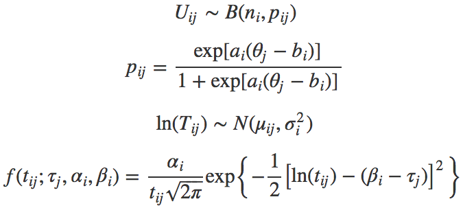

```{r setup, include=FALSE}
knitr::opts_chunk$set(echo = FALSE)
```


# A Latent Variable Model for ORF
This project has adopted a latent variable model, which is a modification of a speed-accuracy model by van der Linden @vanderlinden2007. In order to fit data from ORF assessment, van der Linden’s model has been modified by utilizing a binomial count model for the accuracy part of the model, because the response data in the ORF assessment context would be the number of words read correct in each passage. On the other hand, the speed part of the model was kept the same as van der Linden’s model, where time spent to read each passage was modeled by a log-normal factor model. Below, the two parts of the model are described. For estimation of the model parameters, Popgieter et al. @potgieter2018 implemented a Monte Carlo EM algorithm. The paper by Potgieter et. al can be downloaded from <a href="https://arxiv.org/abs/1705.10446">here</a>.  

## Accuracy Part of the Model
In order to model the accuracy of the reading at the passage level, a Binomial count model was employed. In other words, the probability for a given number of correctly read words out of $n$ attempted words was assumed to follow a binomial distribution. Let $U_{ij}$ denote the number of words read correct in passage $i$ by person $j$. $U_{ij}$ was assumed to have a binomial distribution as $U_{ij} \sim B(n_i, p_{ij})$, where $n_i$ is the total number of attempted words in passage $i$, and $p_{ij}$ is the probability of reading each word in passage $i$ correctly by person $j$. Furthermore, $p_{ij}$ is further modeled as

$$
    p_{ij}=\frac{\exp[a_i(\theta_j-b_i)]}{1+\exp[a_i(\theta_j-b_i)]},
$$

where $a_i$ and $b_i$ are the discrimination and difficulty parameters for passage $i$, and $\theta_j$ is the latent trait parameter of accuracy for person $j$, which is similar to the parameterization of the 2-parameter logistic IRT model.  

  According to this parameterization, the probability of reading words correctly for a difficult passage will be low, which in turn will result in low number of words read correct for a given level of $\theta_j$. Conversely, the number of words read correct will be higher for the same level of $\theta_j$ for an easier passage. On the other hand, the discrimination parameter represents the strength of the association between the probability of reading words correctly for the passage and the latent trait of accuracy.  

## Speed Part of the Model
Time variates has a positively skewed distribution. Therefore, log-normal sampling is regarded as a convenient and reasonable choice for the speed model as van der Linden @vanderlinden2007 demonstrated. Accordingly, the same speed part of the model as van der Linden was used. Let $T_{ij}$ be the time spent (in seconds) to read passage $i$ by person $j$. Following the log-normal sampling distribution, natural logarithm of the time variates are assumed to be distributed normally as

$$    \ln(T_{ij})\sim N(\mu_{ij},\sigma^2_i),$$

where $\mu_{ij}$ and $\sigma^2_i$ are the mean and variance of the distribution. The distribution function of the time variates is

$$    
f(t_{ij};\tau_j,\alpha_i,\beta_i)= \frac{\alpha_i}{t_{ij}\sqrt{2\pi}} \exp\left \{ -\frac{1}{2}\left [ \ln(t_{ij})-(\beta_i-\tau_j) \right ]^2 \right \}
$$

as described in van der Linden @vanderlinden2007. Here, the mean and variance of this distribution are

$$
    \mu_{ij}=\beta_i-\tau_j
$$
and

$$
    \sigma^2_i=\frac{1}{\alpha^2_i},
$$

where $\tau_j$ is the speed ability for person $j$, and $\beta_i$ and $\alpha_i$ are the time intensity and time discrimination parameters for passage $i$, respectively. According to this parameterization, reading a passage that has a higher time intensity parameter will take more time compared to a passage that has a lower intensity parameter, given the same level of speed ability $\tau_j$. On the other hand, a time discrimination parameter represents the strength of the association between the time to read the passage and the speed ability $\tau_j$. Note that the variance of the log-time variates are at the passage level in our formulation.

## Relation between Accuracy and Speed Parameters
Parameters of the accuracy and speed models are assumed to be related to each other. Namely, parameters in the accuracy and speed models are jointly modeled and correlated. Let $\xi_j=(\theta_j,\tau_j)$ be the vector of ability parameters for person $j$, and $\psi_i=(a_i,b_i,\alpha_i,\beta_i)$ the vector of passage parameters for passage i. Both vectors of parameters are assumed to be from multivariate normal distributions. The person parameters are 
$\xi_j \sim MVN(\mu_P, \Sigma_P)$, with a mean vector $\mu_P=(\mu_\theta, \mu_\tau)$, and a covariance matrix
$$\Sigma_P=\begin{bmatrix}
\sigma^2_\theta & \\ 
 \sigma_{\theta\tau} & \sigma^2_\tau 
\end{bmatrix}.$$
On the other hand, the passage parameters are $\psi_I \sim MVN(\mu_I,\Sigma_I),$ with a mean vector $\mu_I=(\mu_a,\mu_b,\mu_\alpha,\mu_\beta)$ and a covariance matrix
$$\Sigma_I=\begin{bmatrix}
\sigma^2_a &  &  & \\ 
\sigma^2_{ba} & \sigma^2_b &  & \\ 
\sigma^2_{\alpha a} & \sigma^2_{\alpha b} & \sigma^2_\alpha & \\ 
\sigma^2_{\beta\alpha} & \sigma^2_{\beta b} & \sigma^2_{\beta \alpha} & \sigma^2_\beta
\end{bmatrix}.$$
For model identification, it is reasonable to impose constraints such as $\mu_\theta=0$, $\sigma_\theta^2=1$, and $\mu_\tau=0$.

```{r layout="l-body-outset"}

```
