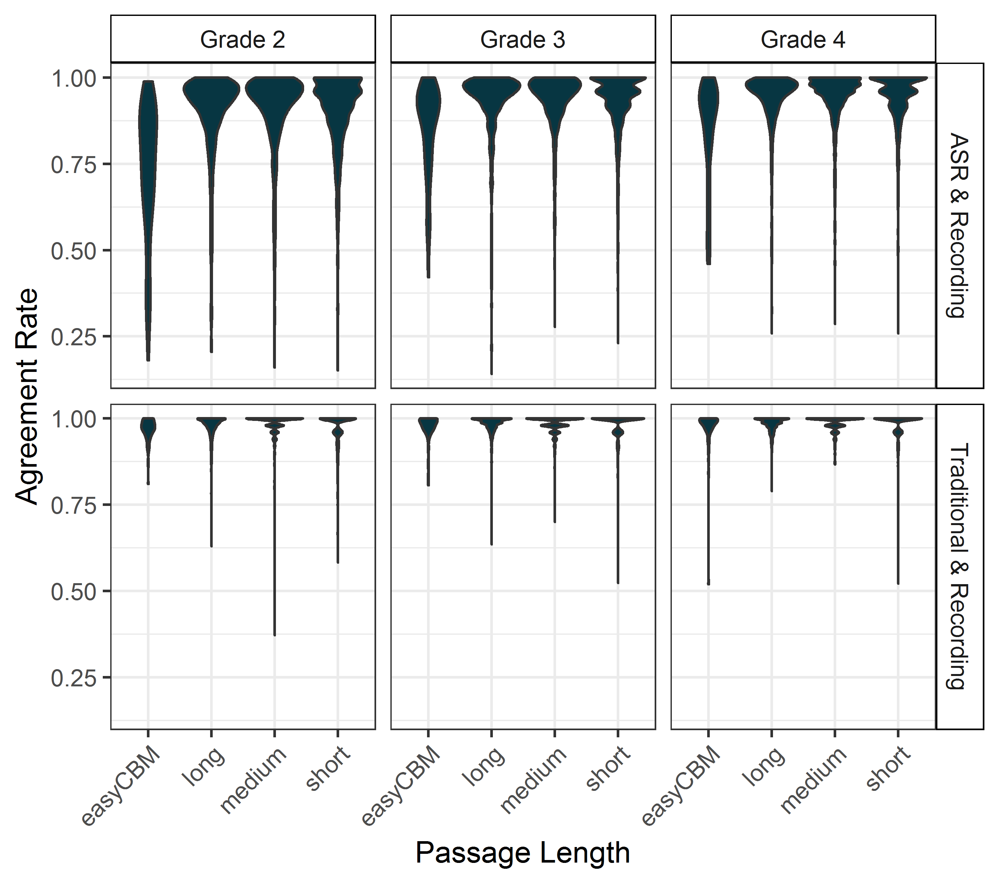

<h2 id="top" /h2>

```{r}
library(rio)
library(tidyverse)
library(stringr)
library(gt)
library(knitr)
library(ggthemes)
library(numform)
```

## Introduction

We examined the differences in word score agreement for three scoring methods of curriculum-based measurement of oral reading fluency (CBM-R). The three `scoring methods` were: (1) `Traditional` - the real-time human scores, comparable to traditional CBM-R assessments in schools; (2) `ASR` - automatic speech recogntion scores; and (3) `Recording` - the criterion measure, where recorded audio files were scored by human assessors in a private space wearing headsets (with the ability to rewind, replay, and adjust audio). We also explored the effect of `passage length` using: (1) *easyCBM* passages as traditional CBM-R passages of about 250 words read for 60 seconds; and **CORE** passages read in their entirety that were (2) *long*, about 85 words, (3) *medium*, about 50 words, and (4) *short*, about 25 words.

This is the first study to compare scores by expert assessors to both ASR and traditional CMB-R scores consistent with those conducted in schools. These comparisons allowed for the analysis of the potential net gain of ASR compared to current school practices (as opposed to scores based on audio recordings), which we speculate is a more useful metric for educators, administrators, school district officials, and stakeholders. 
These results are part of our larger **Content & Convergent Evidence Study**. For details about the Content & Convergent Evidence Study procedures, including information on the sample, CBM-R passages, administration, and scoring methods, go [here](https://jnese.github.io/core-blog/posts/2019-04-04-content-convergent-evidence-study-procedures/).

Passage-level results of words correct per minute (WCPM) scores for comparisons of `scoring methods` can be found [here](https://jnese.github.io/core-blog/posts/2019-04-16-asr-can-score-cbmr-assessments/), and results comparing `passage lengths` can be found [here](https://jnese.github.io/core-blog/posts/2019-04-17-shorter-passages-can-be-used-for-cbmr-assessments/).

## Summary

We found, on average, very high word-score agreement rates between the `Recording` criterion and `Traditional` scores (.97 to .99), as well as high word score agreement rates between the `Recording` criterion and `ASR` scores (.73 to .94). Although the human-to-human agreement rates were exceedingly high and had much less variance than the human-to-machine agreement rates, in general, the `ASR` performed well compared to the criterion word scores. 

If, according to Zechner et al. (2012)@zechner2012, the “known” `ASR` word accuracy rate for students is 71% to 85%, then All but one of these `ASR & Recording` average agreement rates exceeded the highest end of the `ASR` word accuracy rate for students. 

Given these results, stakeholders and educators can weigh the balance between high accuracy of human assessors and the resource demands of one-to-one CBM-R administration. That is, although there is some loss in accuracy of CBM-R word scores with an `ASR` system, gains stand to made in terms of time and human resources in administration, as an entire classroom can be assessed and scored simultaneously under the supervision of one educator. 

In addition, the loss in word accuracy is less conspicuous when looking at WCPM scores, as demonstrated by the results reported [here]( https://jnese.github.io/core-blog/posts/2019-04-16-asr-can-score-cbmr-assessments/). 

Even more, this trade-off in accuracy and resources should only level in time as technology advances and `ASR` engines become more accurate.

## Analyses

We calculated the percent of words read in a passage that were scored in agreement (as correct or incorrect) between the `Recording` criterion and the `ASR` or `Traditional` scores.

## Results

The table below shows the mean (*SD*) agreement rates between `ASR & Recording` and `Traditional & Recording` aggregated by grade and passage length.

```{r layout="l-body-outset"} 
table_word_agree  <- import("C:/Users/Joe/Desktop/BRT/GRANT-CORE/Project/Publications/year_1_2_project/data/table_word_agree.Rdata")

table_word_agree %>%
  select(-c(n.passages, n.students, n.sessions)) %>% 
  mutate(grade = recode(grade,
                        '2' = "Grade 2",
                        '3' = "Grade 3",
                        '4' = "Grade 4")) %>% 
  group_by(grade) %>% 
  mutate_at(vars(asr_sd_rate, dur_sd_rate), .funs = funs(. * -1)) %>% 
  gt() %>% 
  fmt_number(columns = vars(asr_sd_rate),
             negative_val = "parens") %>% 
  fmt_number(columns = vars(dur_sd_rate),
             negative_val = "parens") %>% 
  tab_spanner(label = "ASR & Recording",
              columns = vars(asr_mn_rate, asr_sd_rate)) %>% 
  tab_spanner(label = "Traditional & Recording",
              columns = vars(dur_mn_rate, dur_sd_rate)) %>% 
  cols_align(
    align = "right",
    vars(asr_mn_rate, asr_sd_rate, dur_mn_rate, dur_sd_rate)
  ) %>% 
   cols_label(
    asr_mn_rate = "Mean",
    asr_sd_rate = "(SD)",
    dur_mn_rate = "Mean",
    dur_sd_rate = "(SD)",
    length = ""
   ) 
```

In general, the average agreement rates between `Traditional & Recording `were exceptionally high, ranging from .97 to .99, and the average agreement rates between `ASR & Recording` were also high, ranging from .73 to .94 (all but one were above .85). The *SD*s for the `Traditional & Recording` agreement rates (.02 to .07) were two to seven times smaller than those for `ASR & Recording` (.08 to .20), indicating much less variance in the former. 

The figure below shows the violin plot distributions of passage-level agreement rate by grade and passage length, separately for `ASR & Recording` and `Traditional & Recording`. The interquartile ranges for the `Traditional & Recording` agreement rates are much smaller and generally set near 1.0, whereas those interquartile ranges are larger for `ASR & Recording` and set near .85 or above. The `ASR-Recording` agreement rates are poorest for the easyCBM passages.

```{r layout="l-body-outset"}

```

## Acknowledgments {.appendix}

The research reported here was supported by the Institute of Education Sciences, U.S. Department of Education, through Grant [R305A140203](https://ies.ed.gov/funding/grantsearch/details.asp?ID=1492) to the University of Oregon. The opinions expressed are those of the authors and do not represent views of the Institute or the U.S. Department of Education.